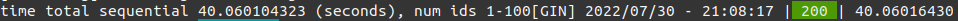

# provide services (info)
### sequential time for provide service

### concurrency time for provide service

# provide services (info)
### sequential time for refresh service

### concurrency time for refresh service

| Service |    Type     |         Time |
|---------|:-----------:|-------------:|
| provide | sequential  |   40 seconds |
| provide | concurrency | 2.45 seconds |
| refresh | sequential  |  1.2 minutes |
| refresh | concurrency |  5.4 seconds |